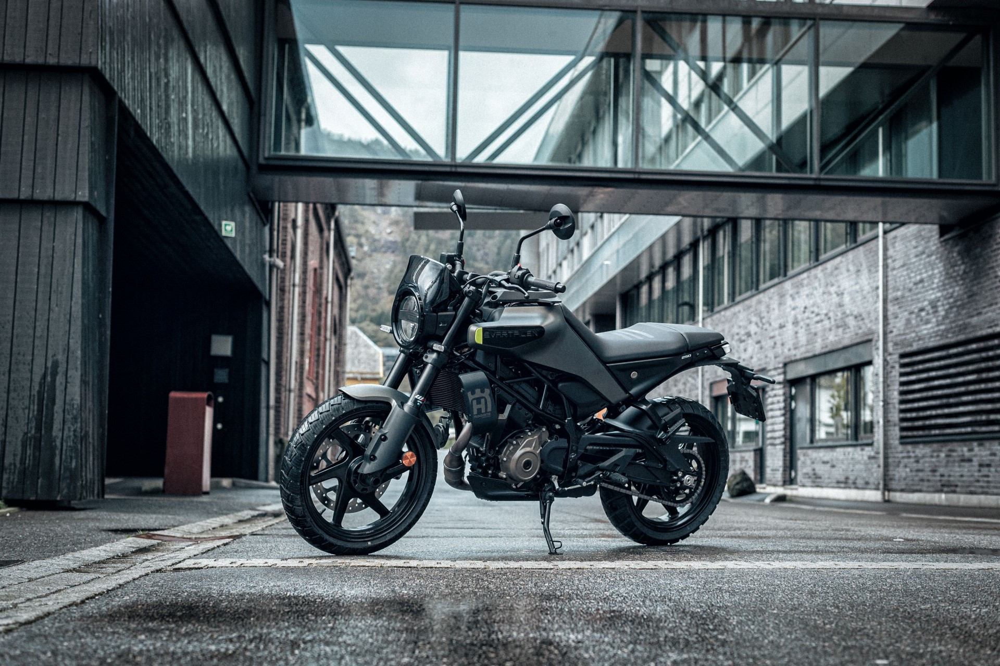

# Husqvarna Svartpilen 250 Website

A responsive, modern website showcasing the Husqvarna Svartpilen 250 motorcycle. This project was created as an educational practice project to demonstrate front-end development skills.

## Features

- Responsive design that works on desktop and mobile devices
- Smooth scrolling and animations using AOS (Animate On Scroll) library
- Interactive map integration using Leaflet.js
- Dynamic image galleries with zoom effects
- Tabbed technical specifications
- Bootstrap 5 framework for layout and components
- SASS/SCSS for structured styling
- Modern UI with attention to typography and spacing

## Technologies Used

- HTML5
- CSS3/SASS
- JavaScript
- Bootstrap 5
- AOS (Animate On Scroll)
- Leaflet.js for maps
- Remix Icons
- OpenStreetMap

## Project Structure
├── index.html
├── data/
│ ├── css/
│ │ ├── style.sass
│ │ └── clash-display.css
│ ├── js/
│ │ └── main.js
│ └── images/
└── README.md